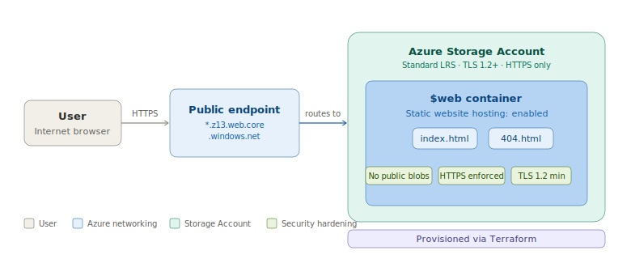

# Hosting Your First Static Website in Azure

---

## Overview

This project deploys a public-facing static website using **Azure Blob Storage** with infrastructure provisioned via **Terraform**. There are no virtual machines, no web servers, and no app runtimes involved — Azure Blob Storage serves the HTML file directly to the internet through a built-in static website endpoint.

Rather than clicking through the Azure Portal, all resources are defined as code, making the deployment repeatable, version-controlled, and consistent across environments.

---

## Architecture



**Key insight:** The storage account is locked down — public blob access is disabled and all traffic is forced over HTTPS with a minimum of TLS 1.2. The static website endpoint is the only intended ingress point.

---

## Prerequisites

- [ ] Active Azure Subscription ([Free Tier](https://azure.microsoft.com/en-us/free/) works fine)
- [ ] [Terraform](https://developer.hashicorp.com/terraform/install) installed (v1.3+)
- [ ] [Azure CLI](https://learn.microsoft.com/en-us/cli/azure/install-azure-cli) installed and authenticated (`az login`)
- [ ] Access to the [Azure Portal](https://portal.azure.com)
- [ ] A text editor (VS Code recommended)

---

## Naming Conventions

| Resource | Value |
|---|---|
| Resource Group | `var.resource_group_name` |
| Storage Account | `var.storage_account_name` |
| Region | Defined via `var.location` |

> **Note:** Storage account names must be globally unique, all lowercase, and contain only letters and numbers — no hyphens or special characters.

---

## Project Structure

```
.
├── main.tf          # Resource Group and Storage Account definitions
├── variables.tf     # Input variable declarations
└── index.html       # Static website content
```

---

## Security Decisions

| Setting | Value | Why |
|---|---|---|
| `allow_nested_items_to_be_public` | `false` | Prevents individual blobs from being made publicly accessible |
| `public_network_access_enabled` | `false` | Restricts access to the static website endpoint only |
| `https_traffic_only_enabled` | `true` | Enforces encrypted transit — no plain HTTP |
| `min_tls_version` | `TLS1_2` | Blocks older, vulnerable TLS versions (1.0, 1.1) |
| `delete_retention_policy.days` | `7` | Soft-delete window for blob recovery |

---

## Deployment

### 1 — Authenticate to Azure

```bash
az login
```

> 📸 **Screenshot:** Terminal output showing successful `az login` authentication.
> ``

---

### 2 — Initialize Terraform

```bash
terraform init
```

> 📸 **Screenshot:** Terminal output showing `Terraform has been successfully initialized`.
> ``

---

### 3 — Review the plan

```bash
terraform plan
```

> 📸 **Screenshot:** Terminal output showing the planned resources — Resource Group and Storage Account — with the `Plan: 2 to add` summary line visible.
> ``

---

### 4 — Apply

```bash
terraform apply
```

Type `yes` when prompted. Terraform will provision the Resource Group and Storage Account.

> 📸 **Screenshot:** Terminal output showing `Apply complete! Resources: 2 added`.
> ``

---

### 5 — Enable Static Website Hosting (Azure Portal)

Once `terraform apply` completes, finish configuration through the Azure Portal:

1. Navigate to the Storage Account in the [Azure Portal](https://portal.azure.com).
2. In the left menu under **Data management**, click **Static website**.
3. Toggle to **Enabled**.
4. Set **Index document name** to `index.html` and **Error document path** to `404.html`.
5. Click **Save**.
6. Copy the **Primary endpoint** URL that appears — this is your site's public address.

> 📸 **Screenshot:** Storage Account blade in the portal with the Static website panel open, toggle set to Enabled, and the Primary endpoint URL visible after saving.
> ``

---

### 6 — Upload Website Content (Azure Portal)

1. In the left menu under **Data storage**, click **Containers**.
2. Open the **`$web`** container (auto-created when static hosting was enabled).
3. Click **Upload**, select your `index.html` file, and click **Upload**.

> 📸 **Screenshot:** The `$web` container in the portal showing `index.html` successfully uploaded.
> ``

---

### 7 — Validate

Open the Primary endpoint URL from Step 5 in a browser. You should see your static site live.

> 📸 **Screenshot:** Browser displaying the live static website at the Azure primary endpoint URL.
> ``

---

## Troubleshooting

| Symptom | Likely Cause | Fix |
|---|---|---|
| `404 - The requested content does not exist.` | Filename mismatch | The file must be named exactly `index.html` — Azure is case-sensitive. |
| `404` after correct upload | Wrong container | Confirm the file was uploaded to `$web`, not another container. |
| `Storage account name is already taken` | Global name collision | Append random numbers to the name (e.g., `stwebsite99`). |
| Static website toggle missing | Feature not visible | Ensure you're in the Storage Account blade, not the Resource Group. |

---

## Clean Up

Destroy all provisioned resources with a single command:

```bash
terraform destroy
```

Type `yes` when prompted. This removes the Resource Group and everything inside it.

> 📸 **Screenshot:** Terminal output showing `Destroy complete! Resources: 2 destroyed`.
> ``

---

## What You Learned

- How to define and provision an **Azure Resource Group** and **Storage Account** using Terraform.
- How to apply **security hardening** at the storage account level (TLS enforcement, no public blob access).
- How to enable **static website hosting** and upload content via the Azure Portal.
- A hybrid IaC workflow — infrastructure provisioned as code, post-deploy configuration handled through the portal.

---

## Related Labs

| Lab | Topic |
|---|---|
| Lab 02 | *(Coming soon)* |
